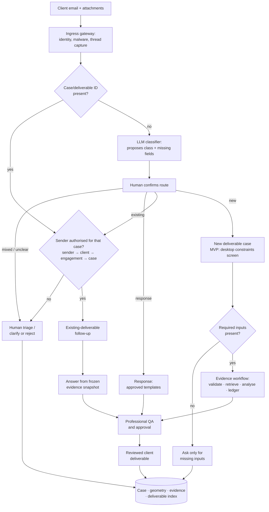
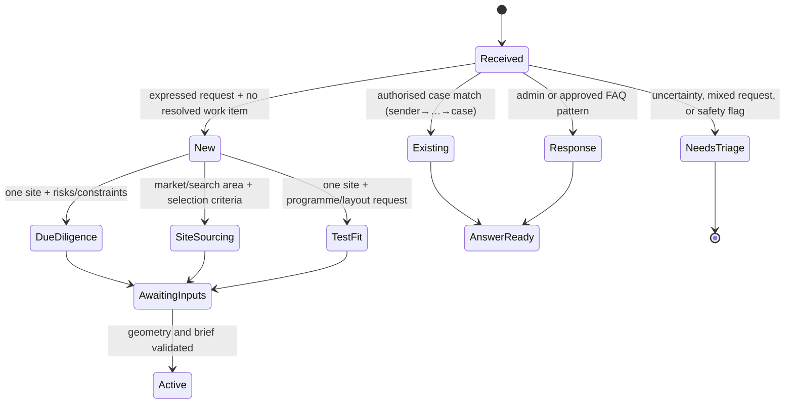
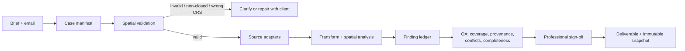
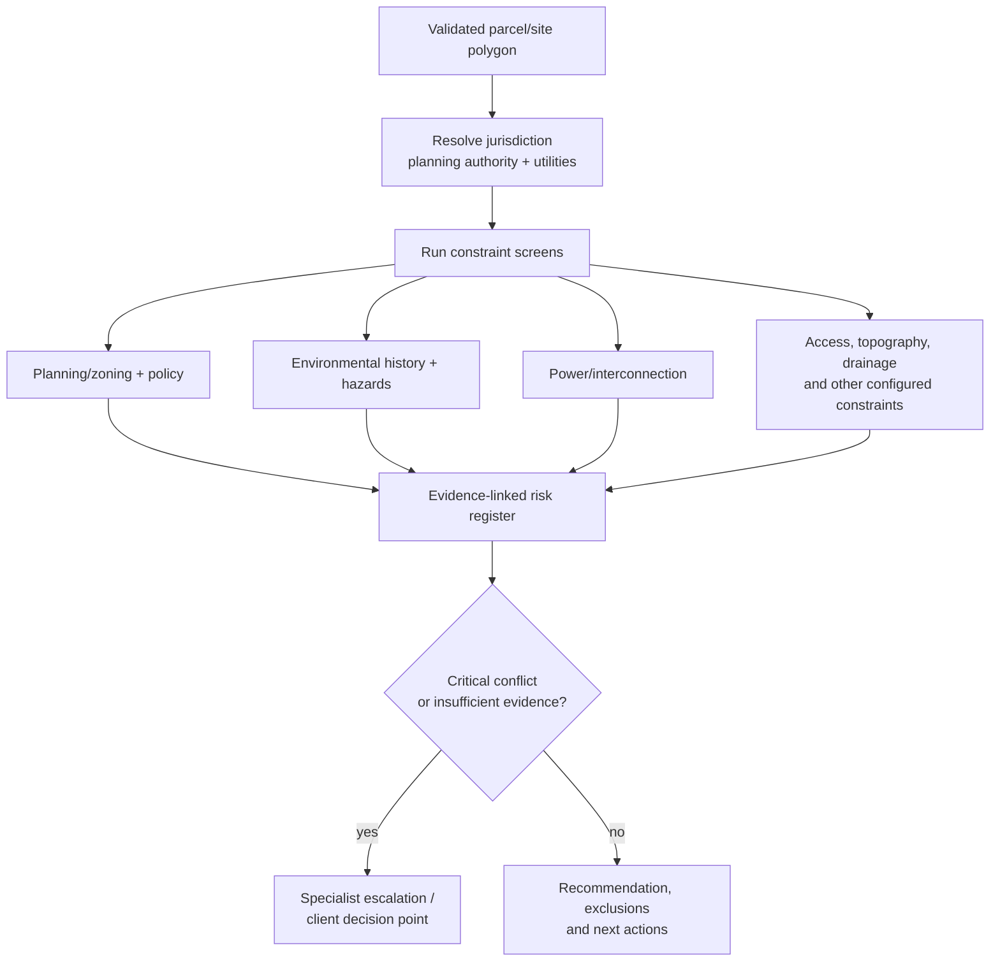
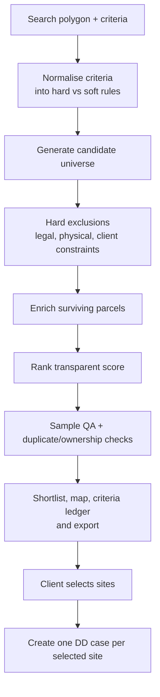
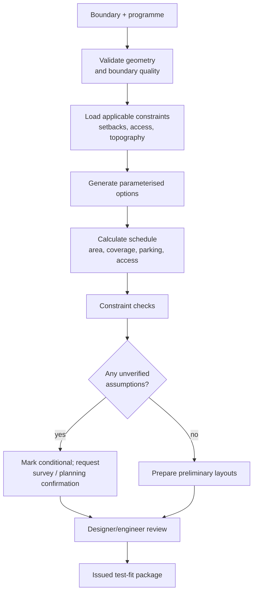
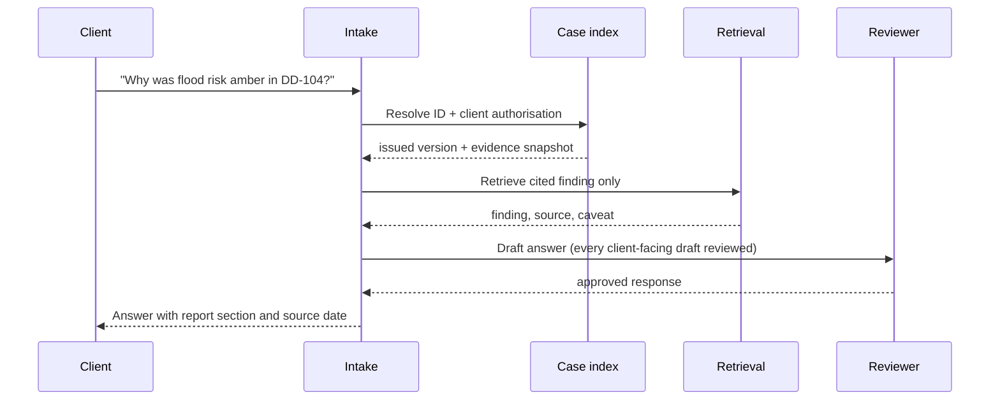
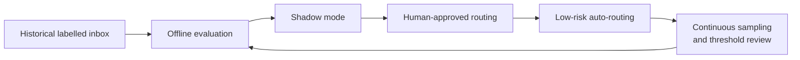

# Agent-driven workflow for site and construction work

**Decision:** build this as a *case-routing and evidence-production system*, not an autonomous planning or engineering adviser. For the MVP, classification leans on a single LLM step with a fixed taxonomy and structured output, plus one near-free deterministic short-circuit (exact case/deliverable ID on an authenticated thread); promoting routing to the predominantly deterministic rules-plus-embedding cascade is deferred until we have labelled mail to calibrate it — see [ADR-0001: Email classification strategy](docs/adr/0001-classification-strategy.md). A licensed or appropriately accountable professional remains the release authority for advice, drawings, and any jurisdictional conclusion.

> **Scope assumption.** Jurisdiction-aware, not jurisdiction-neutral. Examples use US environmental/grid sources and UK planning terms because the rules and datasets are local. Every client, site, and deliverable carries a `jurisdiction` field before work is released.

## Guiding principles (long-term)

1. **End-to-end reliability over local cleverness.** Optimise for a workflow that completes correctly from ingestion to released deliverable — not for any one component's sophistication. Every stage is validated, versioned, and reproducible (§4, §7).
2. **Bias against false classification.** A wrong route costs more than a deferred one, so the model never routes autonomously on its own confidence — that number is uncalibrated until measured against corrected outcomes. In the MVP a human confirms every route; a calibrated **confidence threshold** for autonomous routing is introduced only once an offline calibration set exists, and even then mixed-intent or safety-flagged mail still escalates. Track false-new vs missed-new rates separately (§3, §8).
3. **Human authority on release.** Automate analysis; a credentialed professional approves any advice, drawing, or jurisdictional conclusion before it leaves (§7).

## MVP targets

**Outcome.** An authenticated client submits one site; the system produces a traceable, human-approved **desktop constraints screen** for one jurisdiction, then answers later questions from the frozen evidence pack. This is a screen, not professional due diligence (§5A).

| Area | MVP bar |
|---|---|
| Classification | LLM *proposes* route + missing fields; **a human confirms every route**. Confidence thresholds only after an offline calibration set exists |
| Authorisation | Attach/retrieve only after sender → client → engagement → case authorisation; otherwise triage |
| Coverage | One configured jurisdiction; one desktop constraints screen end-to-end |
| Inputs | Polygon validation + missing-input questions; versioned case manifest |
| Sources | Exactly three named adapters — planning/zoning, environmental registry, relevant utility/RTO. Every result is **found, not found, or unknown** |
| Reliability | Four hard gates enforced: auth → geometry/jurisdiction → provenance → approval |
| Human-in-loop | Every client-facing draft reviewed; nothing auto-sent |
| Learning | Log every classifier decision + human correction from day one |

**Build only:** (1) case registry, sender→engagement authorisation, immutable audit record, human triage queue; (2) LLM-assisted classification + missing-input extraction with human route confirmation; (3) polygon validation + the three source adapters above; (4) findings ledger, raw-evidence snapshot, reviewed report, snapshot-only follow-up retrieval.

**Defer — do not build, even stubbed:** site sourcing, test fit, rankings, autonomous routing, automatic replies, dynamic source selection, parametric layouts. (§5B and §5C below document the future design, not MVP scope.)

## 1. Domain model

| Requested class | What the customer is really asking for | Minimum spatial input | Typical output | Decision it supports |
|---|---|---|---|---|
| **Due diligence** | Is *this* site viable, and what could change cost, programme, or liability? | Parcel/site polygon; address acceptable only for intake | constraint/risk register, evidence pack, recommendation and exclusions | acquire, option, advance, or stop |
| **Site sourcing** | Which sites across a market satisfy an investment/development brief? | search area polygon plus criteria | ranked candidate inventory, exclusions, provenance | outreach / shortlist |
| **Test fit** | Can a proposed programme plausibly fit on *this* site? | surveyed/site boundary plus programme | preliminary massing/layout, assumptions and constraints | pursue feasibility / commission design |
| **Existing-deliverable follow-up** | Explain, correct, or extend a completed item without creating a new scope | deliverable/case ID or thread linkage | cited answer, change request, or escalation | client response |
| **Response** | General question, administration, or non-project communication | none | answer or routed human task | communication only |

Anchored to standard practice: due diligence is a systematic professional review of a property's characteristics and risks, not a promise it is risk-free ([RICS technical due-diligence standard](https://www.rics.org/profession-standards/rics-standards-and-guidance/sector-standards/real-estate-standards/technical-due-diligence-of-commercial-property)); US environmental due diligence carries a liability-sensitive meaning via EPA All Appropriate Inquiries ([EPA](https://www.epa.gov/brownfields/brownfields-all-appropriate-inquiries)); a test fit is early feasibility/concept work, not detailed design ([RIBA Stages 1–2](https://www.riba.org/work/insights-and-resources/riba-plan-of-work/)).

## 2. The operating model

End-to-end flow, top to bottom:



### Classification for the MVP

One LLM step (fixed taxonomy, structured output) replaces the deterministic-rules-plus-embedding cascade, which is **deferred** until we have labelled mail to calibrate it — see [ADR-0001](docs/adr/0001-classification-strategy.md). The model **proposes** a route and the missing fields; a human confirms every route in the MVP, because model-reported confidence is uncalibrated until measured. A case/deliverable ID is only a hint, never an attach key: nothing is attached or retrieved until the sender is authorised for that specific case along the **sender → client → engagement → case** chain — otherwise it goes to triage. This closes the cross-client disclosure path where a client forwards, quotes, or mistypes another engagement's ID.

**Contract:** the model gets the message, the taxonomy, and *retrieved candidate case metadata only* (not an open toolset), and returns `{class, subtype, confidence, evidence_spans, candidate_case_ids, missing_fields}`. The `confidence` is logged for offline calibration, not used to auto-route in the MVP. Output is a recommendation a human confirms — never authority to release a regulated conclusion ([NIST AI RMF](https://www.nist.gov/itl/ai-risk-management-framework)).

## 3. Email classification contract



### Routing signals and guardrails

In the MVP these signals are encoded as instructions and guardrails for the LLM classifier — the model is told the taxonomy below and must honour each guardrail. They double as the spec for the deterministic rules we will promote later (see [ADR-0001](docs/adr/0001-classification-strategy.md)); a signal only graduates to a hard rule once it is measured to be safe.

| Signal | Route | Guardrail |
|---|---|---|
| Case/deliverable ID present | existing deliverable (hint only) | attach/retrieve only after sender → client → engagement → case authorisation; an unauthorised or mismatched ID goes to triage, never attaches |
| Reply to a single completed deliverable and verbs such as “clarify”, “where did”, “update page” | existing deliverable | detect requests that add a new site, programme, or material analysis; propose a scope change |
| Billing, meeting scheduling, portal access, document resend | response | use approved templates; do not invent commitments |
| One named site + terms such as planning/zoning, grid/power, environmental, access, title | due diligence | require jurisdiction and site geometry before analysis |
| Area/market + “find”, “screen”, “all sites”, acreage/size/price/criteria | site sourcing | require search boundary and explicit ranking criteria |
| One site + units/GFA/parking/setbacks/massing/layout | test fit | require programme and boundary quality |

Mixed messages are normal. Split “Can you explain last week's report, and also test 300 units on the adjacent parcel?” into one existing-deliverable answer and a proposed new test-fit case; never silently merge them.

## 4. Case creation and common evidence controls



Every case should have a versioned manifest, not a folder full of opaque attachments:

```yaml
case_id: DD-2026-0042
client_id: ACME-01
engagement_id: ACME-ENG-7          # authorisation is checked against this
jurisdiction: US-CA                 # country, state/region, authority where known
request_type: desktop_constraints_screen
site_geometry:
  source: client_supplied_geojson
  crs: EPSG:4326
  hash: sha256:...
  accuracy: indicative              # indicative | parcel | survey
brief_version: 1
sources:
  - source_id: county-zoning
    request: "GET https://.../arcgis/...&geometry=..."  # exact URL/API request
    query_geometry_hash: sha256:...   # site polygon + buffer actually queried
    raw_hash: sha256:...              # immutable hash of the raw response/file
    published_as_of: 2026-05-01       # source's own as-of date (not retrieval time)
    retrieved_at: 2026-06-22T10:00:00Z
    parser_version: zoning-adapter@1.4.2
    crs: EPSG:2227
    status: found                     # found | not_found | unknown
    licence: ...
analysis_version: screen@0.3.0
findings: []
release_status: draft               # draft | qa_passed | approved | issued
```

Provenance must let us **reproduce and defend** an analysis, not merely name a source. For every source query retain: the exact URL/API request, the immutable raw-response/file hash, the query geometry + buffer, the source's published/as-of date, the parser/schema version, the CRS and geometry accuracy, and the analysis version — plus the original message + attachments, classifier decision + evidence spans, reviewer identity, and deliverable version. A source failure or missing coverage must resolve to **`unknown`, never green**. Source data and policy change, so the trail must be reproducible — supporting measurement and governance over opaque judgement ([NIST AI RMF 1.0](https://www.nist.gov/publications/artificial-intelligence-risk-management-framework-ai-rmf-10)).

## 5. Workflows by deliverable

### A. Individual-site desktop constraints screen (MVP)

The automated MVP output is a **desktop constraints screen** — a zoning / environmental / power screen from public records and GIS. It is *not* professional due diligence: EPA All Appropriate Inquiries (Phase I) additionally requires record review, a site inspection, interviews, data-gap assessment, and an environmental professional's conclusions, which automation alone cannot produce ([EPA AAI](https://www.epa.gov/brownfields/brownfields-all-appropriate-inquiries)). Full due diligence layers those professional steps on top of this screen.



**Inputs:** site polygon, address/APN/land registry ID where available, intended use and scale, target schedule, jurisdiction, and any existing reports. Address-only intake can create an *unvalidated* case but must not run an automated boundary-dependent conclusion.

**Outputs:** a finding ledger rather than a single red/amber/green score: `topic`, `finding`, `evidence`, `source date`, `confidence`, `impact`, `owner`, `recommended next action`, and `explicit exclusion`. Planning conclusions must identify the governing authority; for example, UK government guidance directs applicants to the relevant local planning authority to establish whether permission is needed. [GOV.UK](https://www.gov.uk/planning-permission-england-wales/).

**Power:** screen proximity, published capacity/queue data and the applicable utility/RTO process, but label this as a *screen* until a utility study. In the US, FERC standardises relevant procedures/agreements, while the actual interconnection process is administered by transmission providers. [FERC](https://www.ferc.gov/generator-interconnection). Do not allow the agent to state that capacity is “available” unless a documented authoritative source supports that wording.

**Environment:** automate public-record and spatial screening only, then refer contamination/liability determinations to the qualified environmental-professional workflow. Public-record/GIS screening is an *input* to a Phase I, never a substitute: EPA's AAI is a legal-liability framework requiring record review, inspection, interviews, and a professional's conclusions — not a generic overlay. [EPA](https://www.epa.gov/brownfields/brownfields-all-appropriate-inquiries).

### B. Market/site sourcing



Require the customer to declare **hard constraints** (e.g., outside boundary, minimum site area, prohibited zoning), **soft preferences** (e.g., transit score), and their priority/weight. A ranking is only defensible if the exported result shows the criterion values, weights, data vintage, and exclusion reason—never only a black-box rank.

For US base layers, USGS's National Map provides broad nationwide layers (boundaries, elevation, hydrography, structures, transport, imagery). Treat "authoritative" as a property of a specific configured source and field, not a blanket claim: USGS is not parcel or title authority; retain its as-of and retrieval dates. [USGS](https://www.usgs.gov/geospatial-data). Each configured jurisdiction names its own parcel, planning, environmental and utility sources; source adapters are configuration, not prompt text.

### C. Test fit



The output is a feasibility artefact: labelled options, dimensional schedule, assumptions, constraints considered, and a clear “not for construction / not a planning determination” status. It must not become a construction drawing through automation. This boundary reflects the separation between early feasibility/concept work and later technical design/construction stages in the RIBA Plan of Work. [RIBA](https://www.riba.org/work/insights-and-resources/riba-plan-of-work/).

## 6. Responses and completed-deliverable follow-ups

The retrieval source for a follow-up is the issued deliverable plus its frozen evidence snapshot, not the latest web data. If the client asks “has this changed?”, create a dated update/scope-change task that compares the original snapshot with current sources. This prevents an agent from unknowingly revising a historical conclusion. In the MVP **every** client-facing draft — follow-up answers included — is reviewed before sending; auto-send is reserved for a later, narrowly allowlisted set of transactional templates.



## 7. Automation boundaries and controls

| May automate | Human/credentialed review required | Never infer or do automatically |
|---|---|---|
| ingestion, deduplication, geometry validation, source retrieval, overlays, calculations, report assembly, citations, missing-input questions | scope acceptance, jurisdiction mapping exceptions, conflicting-source resolution, material risk rating, environmental/legal/planning conclusion, design review, external release | legal advice, a certified environmental assessment, a utility interconnection commitment, ownership/title conclusion, planning approval, construction-ready design, accepting commercial terms |

Add four hard gates: (1) client/engagement authorisation before retrieval, (2) geometry and jurisdiction validation before spatial analysis, (3) source provenance/completeness before report generation, and (4) role-based approval before external release. Model calls must use structured outputs, minimum necessary data, prompt-injection-safe attachment handling, and tool allow-lists. A PDF or email can contain instructions but never gains authority to override the system’s policy or trigger external actions.

## 8. Metrics, evaluation, and rollout



Measure separately by class, client, and jurisdiction:

- **Routing quality:** precision/recall, especially false-new-deliverable and missed-new-deliverable rates; abstention rate; time to correct route.
- **Case quality:** percentage with valid geometry, jurisdiction, source provenance, required-input completeness, and review approval.
- **Operational impact:** median intake-to-triage time, specialist-review load, follow-up response time, and source-refresh failure rate.
- **Safety:** unauthorised cross-client retrieval attempts, blocked attachment/prompt-injection attempts, releases without approval, and later material corrections.

Start with a labelled corpus and shadow mode. Only enable deterministic auto-routing for narrow, measured patterns (for example, authenticated replies with an explicit matching deliverable ID). Keep model-routed requests in human approval until the error rate and impact are acceptable for each route. No aggregate “accuracy” score should obscure a rare but expensive misroute.

## 9. Recommended delivery sequence

1. Define taxonomy, case/deliverable IDs, the sender → client → engagement → case authorisation model, and the structured case manifest.
2. Implement the authorisation check + LLM-assisted classification (model proposes, **human confirms every route**) and an analyst triage queue; collect corrected labels from day one.
3. Add polygon validation + missing-input questions.
4. Deliver the desktop constraints screen end-to-end for one jurisdiction with exactly three named source adapters (planning/zoning, environmental registry, utility/RTO); every result is found, not found, or unknown; reviewed report + frozen evidence pack + snapshot-only follow-up retrieval.
5. *(Post-MVP)* Add site sourcing with explicit hard/soft criteria and transparent ranking export.
6. *(Post-MVP)* Add test fit only after a design professional agrees the parametric rules, reviewer interface, and issue status.
7. *(Post-MVP)* Once labelled mail has accumulated, introduce the sophisticated classification cascade (deterministic rules → embedding/small classifier → LLM fallback) per [ADR-0001](docs/adr/0001-classification-strategy.md) in shadow mode, then selectively automate proven paths.
8. *(Post-MVP)* Add evidence-query caching and provider backpressure per [ADR-0002](docs/adr/0002-evidence-query-caching-and-backpressure.md) once real usage justifies it.

## 10. Open decisions before build

1. Which jurisdiction(s), asset classes, and professions are in scope at launch?
2. What is the contractual meaning of each deliverable, its review authority, and its permitted disclaimer language?
3. Which systems supply CRM, email, document management, parcel/land, planning, environmental, utility, and design data—and what are their licences/API limits?
4. What client-specific confidentiality, retention, and cross-border data rules apply?
5. What is the response SLA for ambiguous intake, and who owns the triage queue?

These decisions are prerequisites for credible automation. Until they are made, the workflow should create a triage item and request the missing information rather than fabricate a location, boundary, regulatory conclusion, or scope.
