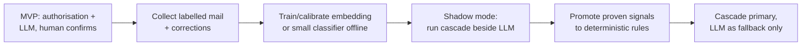

# ADR-0001: Email classification strategy

- **Status:** Accepted
- **Date:** 2026-06-22
- **Deciders:** Workflow design owners
- **Related:** [`AGENT_DRIVEN_REAL_ESTATE_WORKFLOW.md`](../../AGENT_DRIVEN_REAL_ESTATE_WORKFLOW.md) §2–3

## Context

Inbound client email must be classified into a fixed taxonomy — *existing-deliverable follow-up*, *response*, or *new deliverable* (which further splits into *due diligence*, *site sourcing*, *test fit*) — and then routed into the right workflow. Misrouting is expensive in this domain: turning a follow-up question into a new engagement, or missing a real new request, both have real cost and client-trust consequences.

A mature design would route with a **cheap-first cascade**: deterministic signals first (mailbox/client identity, `In-Reply-To`/`References`, prior case/deliverable IDs, attachment geometry type), then a calibrated embedding or small supervised classifier, then a larger language model only on the residual ambiguity. The justification for deferring it is **lower MVP complexity**, not a cost claim: we avoid building, calibrating, and maintaining a multi-stage router before we have the labelled data to evaluate one.

However, that cascade has prerequisites we do not yet have:

- **No labelled corpus.** We cannot calibrate confidence thresholds, choose abstention points, or train/evaluate a small classifier without representative, labelled historical mail.
- **No measured failure distribution.** We don't yet know which signals are actually safe to make deterministic for our clients and jurisdictions.
- **MVP volumes are low.** The cost argument that justifies the cascade only bites at volume. At MVP traffic, one model call per email is affordable.

Building the cascade now would mean hand-tuning thresholds against intuition rather than data, and maintaining more moving parts than the MVP needs.

## Decision

**For the MVP, classify with a single LLM step that proposes a route for human confirmation, gated by an authorisation short-circuit.**

1. **Authorisation short-circuit (kept):** a case/deliverable ID is a hint, not an attach key. Attach or retrieve only after the sender is authorised for that specific case along **sender → client → engagement → case**; an unauthorised or mismatched ID goes to triage. This prevents both the worst misroute ("please explain page 7 of DD-104" becoming a new engagement) and cross-client disclosure via a forwarded, quoted, or mistyped ID.
2. **LLM classifier (primary):** every other message goes to one LLM call with a fixed taxonomy, structured (JSON-schema) output, and *retrieved candidate case metadata only* — not an unrestricted toolset. It returns `{class, subtype, confidence, evidence_spans, candidate_case_ids, missing_fields}`.
3. **Human confirms every route:** the model *proposes* a class and missing fields; a human confirms the route before any work or reply. Model-reported `confidence` is logged for offline calibration but is **not** used to auto-route in the MVP — an autonomous confidence threshold is introduced only once a calibration set exists. Mixed-intent or safety-flagged mail escalates regardless.
4. **Collect labels from day one:** every classifier decision plus its human correction is logged. This corpus is the prerequisite for the deferred work below.

**Explicitly deferred to a later stage:** the lightweight intent scorer, the calibrated embedding / small supervised classifier, and the multi-threshold deterministic cascade.

## Migration path

Promote classification from "LLM-first" to "cascade" incrementally, driven by the data we collect — never wholesale:

Each signal in the workflow doc's "Routing signals and guardrails" table graduates to a hard rule only after it is measured safe in shadow mode.

### Triggers to start the migration

Act when **any** of these holds:

- **Volume:** sustained email volume where per-email LLM cost or latency becomes material (revisit at the point token spend on classification is a noticeable line item).
- **Corpus:** enough labelled, corrected examples per class to train and evaluate a small classifier with confidence (and to set thresholds from data, not intuition).
- **Quality:** the LLM-first router shows a recurring, measurable misroute pattern that a deterministic rule or embedding scorer would catch.

## Consequences

**Positive**

- Fastest path to an end-to-end working workflow; fewer moving parts to build and maintain for the MVP.
- The label corpus needed for the better system is generated as a by-product of running the MVP.
- The deterministic short-circuit still protects against the highest-cost misroute on day one.

**Negative / risks**

- Higher per-email cost and latency than a cascade — acceptable only while volumes are low; this is the explicit trigger to migrate.
- A single LLM call is a single point of judgment; mitigated by **human confirmation of every route**, structured output, and the never-release-without-review gates in the workflow doc (§7).
- Prompt-injection surface: attachments/email bodies can contain instructions. The classifier must use minimum-necessary data, tool allow-lists, and must never gain authority to override policy or trigger external actions.

## Alternatives considered

- **Full cascade now (rejected for MVP):** correct end state, but premature — no labelled data to calibrate it, and unjustified cost/complexity at MVP volume.
- **Pure deterministic rules now (rejected):** brittle against free-text email; would push too much to human triage and fail on the natural variety of inbound prose.
- **No classifier, human triage everything (rejected):** doesn't scale; instead the model pre-classifies and proposes missing fields to make the human confirmation fast, while the human still owns every route.

## References

- NIST AI Risk Management Framework — https://www.nist.gov/itl/ai-risk-management-framework
- Routing pattern for multi-agent workflows — https://medium.com/@huzaifaali4013399/the-routing-pattern-build-smart-multi-agent-ai-workflows-with-langgraph-44f177aadf7a
- Intent recognition & auto-routing in multi-agent systems — https://gist.github.com/mkbctrl/a35764e99fe0c8e8c00b2358f55cd7fa
