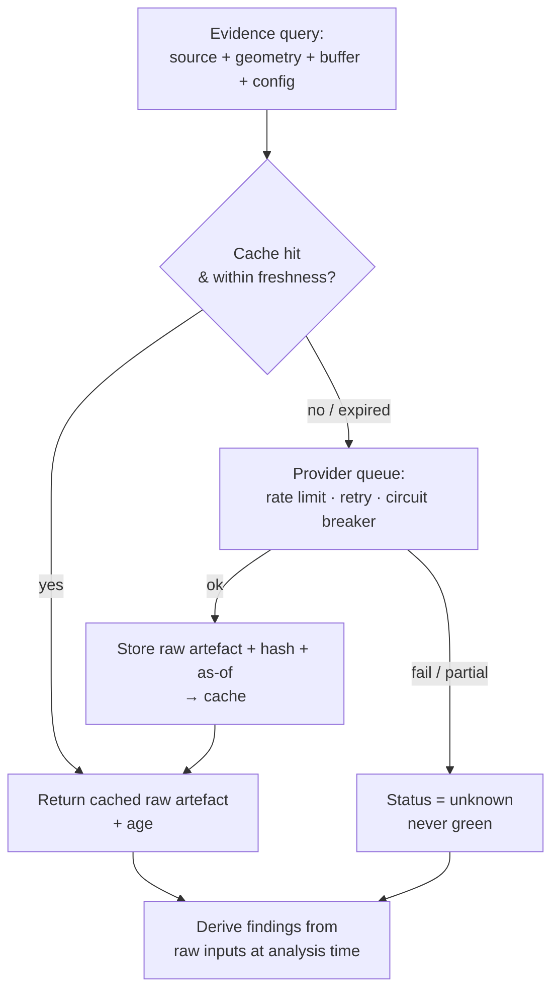

# ADR-0002: Evidence-query caching and provider backpressure

- **Status:** Proposed (deferred until real usage justifies it)
- **Date:** 2026-06-22
- **Deciders:** Workflow design owners
- **Related:** [`AGENT_DRIVEN_REAL_ESTATE_WORKFLOW.md`](../../AGENT_DRIVEN_REAL_ESTATE_WORKFLOW.md) §4, §5A · [ADR-0001](0001-classification-strategy.md)

## Context

The desktop constraints screen (§5A) queries external public sources — planning/zoning, environmental registries, utility/RTO publications. At scale this raises three problems: repeated identical queries waste calls and money; providers rate-limit, fail, or return partial results; and naïve caching risks serving **stale evidence as if current**, which in this domain is a correctness and liability failure, not a performance nuisance.

This is explicitly **out of MVP scope**. Building it before evidence correctness is established would optimise a system we haven't yet proven returns the right answer.

## Decision (when triggered)

Introduce a caching and backpressure layer between the evidence workflow and external providers:

1. **Cache raw source artefacts only** — keyed by `{source version, normalised geometry hash, buffer, query config}`. **Never cache a final risk conclusion**; conclusions are derived from cached *inputs* each run so a parser/analysis change re-derives them.
2. **Backpressure on provider requests** — a queue with per-source rate limits, retries, circuit breakers, and an explicit partial-result status.
3. **Freshness is first-class** — record cache age and source freshness on every artefact. Expired or failed data returns **`unknown`, never green** (consistent with §4's provenance rule).
4. **Promote only after correctness is established** — this layer ships after the screen is shown to return correct evidence, not before.

## Consequences

- **Positive:** preserves correctness under load; bounds provider cost and protects against rate-limit/outage cascades; re-derivable conclusions survive parser/analysis upgrades.
- **Negative / risks:** added infrastructure and a real cache-invalidation problem — mitigated by caching only raw artefacts with explicit freshness, and failing closed to `unknown`.

## Metrics to gate promotion

Measure before and after enabling: **p95 retrieval latency**, **provider failure rate**, **cache-hit rate**, and **queue age**. Promote a source into the cached/queued path only once its evidence correctness is established and these metrics justify it.
